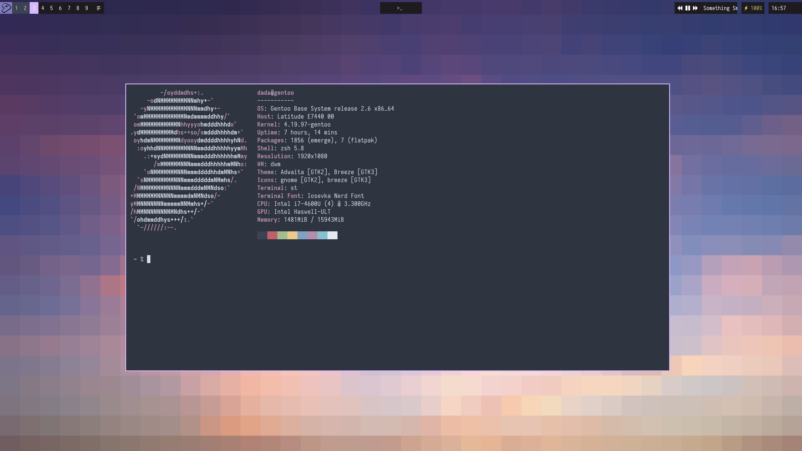
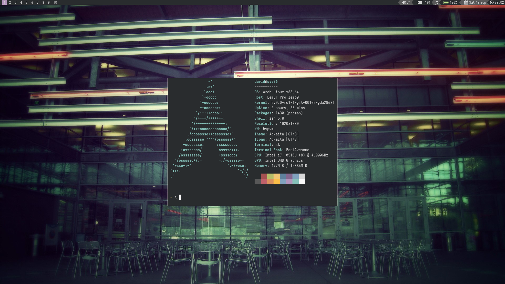

<!--# My dotfiles-->
<!--These are my scripts & dotfiles for gentoo with dwm.-->

<!--Apps I use, in no particular order:-->

<!--weechat, st, qutebrowser, zathura, newsboat, neovim, mpd, ncmpcpp, emacs(sometimes), vifm, neomutt (with mutt-wizard, lemonbar, dzen.-->

<!--## Scripts-->
<!--All scripts can be found in ~/scripts, here's a rundown of the scripts I use regularly.-->

<!---quicktex: If you've got some latex code in your clipboard, it quickly compiles and previews it.-->

<!---mpdmenu: Little dmenu script to interact with mpd.-->

<!---dmenu_run_history: Found on suckless.org, dmenu_run with history.-->

<!---yorn.sh: Yes or No prompt to incorporate in other scripts-->

<!---curcourses: Lets me quickly open pdf's I'm reading with zathura in tabbed, I can also easily add courses with this script.-->

<!---lemonbar/dwm/bar.sh: Lemonbar I use in conjuction with my dwm patch, also bits of dzen2 in there.-->

<!---dwm_tab: Working on it...-->

<!---lemonbar/bar.sh: Sometimes I use bspwm, then I use this bar.-->
## Patches for dwm
### My patch
[This](.suckless/dwm/dwm-script_tags-6.2.diff) patch removes the standard dwm bar and instead writes current tag information to a file.

###Others
[Pertag without the bar](./.suckless/dwm/dwm-6.1-pertag_without_bar.diff)

[Attachabove](./.suckless/dwm/dwm-attachabove-6.2-20200421.diff)

[Ewmhtags](./.suckless/dwm/dwm-ewmhtags-6.2.diff)

[Named Scratchpads](./.suckless/dwm/dwm-namedscratchpads-6.2.diff) with [Floatrules](./.suckless/dwm/dwm-floatrules-6.2.diff)

[Movestack](./.suckless/dwm/dwm-movestack-6.1.diff)

[Vanity Gaps](./.suckless/dwm/dwm-vanitygaps-20190508-6.2.diff)

## Screenshot for dwm

## Screenshot for bspwm

Scripts for bspwm (especially bar script) are under scripts/lemonbar/bspwm and scripts/bspwm

